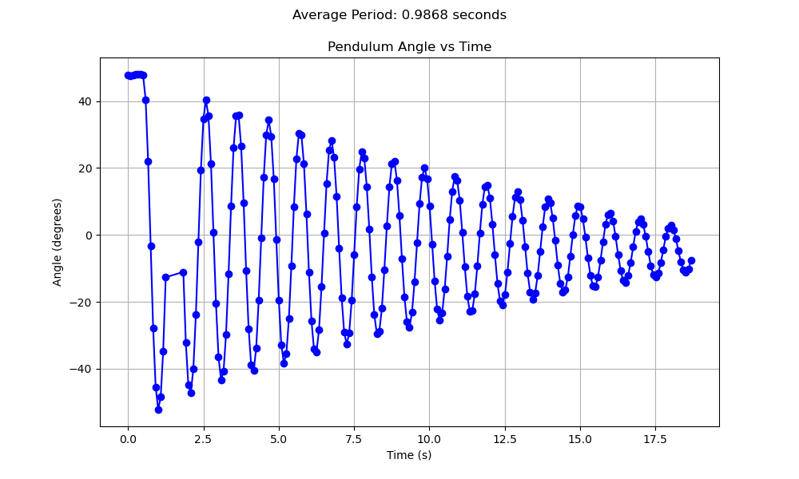
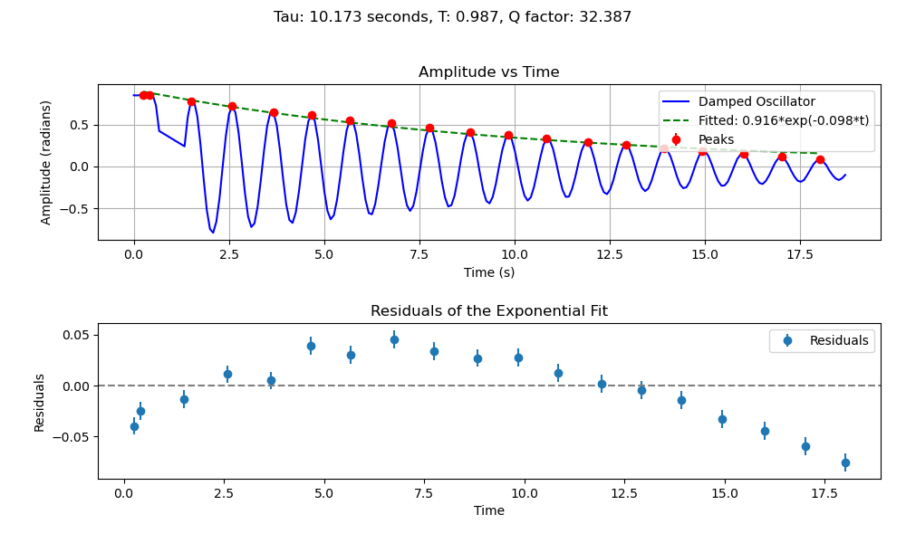

# PHY180 -- Pendulum Motion Tracker

This project utilizes OpenCV's Trackers API to develop an automated tracking system for processing recorded videos of pendulum motion. You should put all the video you wish to process in one directory and the program will automatically process all the files.

> The code is open source and feel free to fork and use it for your project. However, you must credit the creator if the code was used as a part of any academic assignment. Consider giving me a star for the repo too xd

**An angle-time graph will be produced with average period, while logging X, Y, and angle to a csv file. For an entire list of supported graphs, please see [the graphs section](#supported-graphs)** For each video there will be one csv file and one or more graph in the `ouput/` directory.




## Input Requirements

The program works best with videos recorded at _**60fps**_. Most modern smartphones support this framerate and you can check it manually yourself. Technically, it would work for all other framerates (30 or 240) but this could cause unexpected errors with tracker or a wrong time scale.

> NOTE: You can expect bug fixes in future patches. Please create a GitHub Issue if you run into difficulties.

## Contact Me

If you wish to contribute or have questions, reach out to Jet Chiang at [my email](mailto:jetjiang.ez@gmail.com). The project might not be actively maintained over the year but I am happy to help if possible.

## Usage

### Requirements

OpenCV is open source computer vision library written in C++, but provides support for other languages such as Python via its API. You need to install the package from PyPI or Anaconda in order to run this script.

```
pip install opencv-python
conda install opencv
```

**For your convenience, you can initialize a new virtual environment using the requirement files we generated.** If you don't know how to use either Google it or ask ChatGPT help.

```
pip install -r requirements.txt
conda env create -f environment.yaml
```

### Main Tracker

The following script will process all the files in the specified directory:

```
python3 tracker.py --tracker <tracker_type> --source <path-to-videos> --show <True/False>
```

The tracker is defaulted to `KCF` (Kernalized Correlation Filter). All available options for OpenCV 4.0+ are: `tracker_types = ['BOOSTING', 'MIL','KCF', 'TLD', 'MEDIANFLOW', 'GOTURN', 'MOSSE', 'CSRT']`.

> If you don't wish to show the video being tracked, set `--show` to `False`. WARNING: You might run into unexpected errors...

The user will be prompted to:

- Use your mouse to click on the first frame to select the origin to adjust x-y coordinates

- Draw a bounding box on the region of interest (ROI) (i.e. the object you want to track)

- Click `Esc` if you want to quit the video midway, all data and plots will still be recorded

- The next video will begin automatically and the process repeats until all videos are processed

**If you wish to output a different type of graph supported in the list below, feel free to modify part of the program. However, you are discouraged to do it unless you are completely sure what you are doing.**

### Supported Graphs

The following graphs are supported by the graph as per the current release:

1. Regular angle vs. time graph with period computed

2. Amplitude vs. time graph with exponential function fit and Q value computed

3. _More coming!_

Calling main tracker script will automatically generate one or more plots in the output directory. If you want to plot a specific CSV file, you can do that with:

```
python3 plotting.py --path <your-csv-path>
```

> Since this feature is still being worked on, expect enhancements in future patches.

## Known Issues

### OpenCV Version

OpenCV has a very bad API maintenace and legacy support. Once a new version is released, certain API calls are changed / deprecated. This is why if you are using an older version the script might not work, so please search up solutions on StackOverflow or ChatGPT/Copilot. A common error looks like:

```
Traceback (most recent call last):
  File "/Users/xxx/xxx/xxx/opencv-tracking/tracker.py", line 174, in <module>
    "TLD": cv2.TrackerTLD.create,
           ^^^^^^^^^^^^^^
AttributeError: module 'cv2' has no attribute 'TrackerTLD'
```

### Tracking Instability

In the case of failing to track recurrently, consider using a different tracker than the default `KCF`. You can research the different features of each tracker but trial and error should lead to the solution for most use cases.

> Raise a GitHub Issue if severity is high. The issue is being investigated.

### Inaccurate Period

In **RARE** testing scenarios the average period calculated is incorrect. _The issue is currently being investigated and will hopefully be addressed in a future patch._ Please double-check the reasonableness of the output since the program CAN make mistakes!

## TODO

1. In future editions, we have plan to implement automatic object identification either through object detection OR inferencing from manual selection only for the first video.

2. Process the dataframe: remove inconsistency on both ends and filter / double-check the period for anomalies.

3. Plotting error bars!!!! and fitting exponential decay functions!!!
